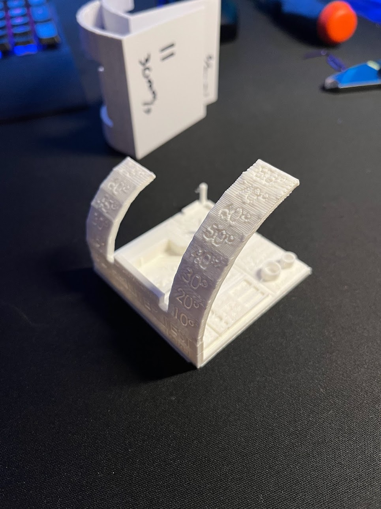

# Recommended 3D Models

## Benchmark Model
[*MINI* All In One 3D printer test](https://www.thingiverse.com/thing:2806295){target=_blank}

{: style="height:350px;width:250px"}

This is a solid benchmark test that I have used after most major upgrades. 
Always good to have consistency with this, and the overhang test is excellent!