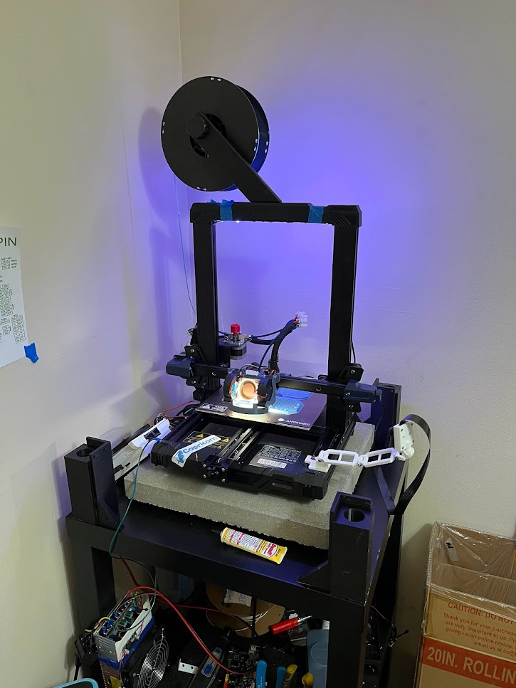

# Welcome to My Mod Page!
## Intro

I decided to make a website to showcase my Kobra Go and the mods I've performed to it.

Future udpates include:
 
* BOM with rough pricing.
* More in-depth software tutorials
* More 3D model recomendations
* More details for hardware mods!

I'll be keeping this up to date to the best of my ability!

## Current Status


* Software: 
    ```Klipper```
* Mainboard:
    ```BTT SKR 3.0 + Raspi 4 4GB```
* Drivers:
    ```TMC2209```
* Stepper Motors:
    ```Stock```
* Hotend:
    ```Microswiss```
* Extruder:
    ```Microswiss Dual Gear Bodwen```
* Printhead:
    ```Hero Me Gen 7.1```
* Cooling: 
    
    ```Noctua NF-A4x20 FLX```

    ```Dual Winsinn 5015```
