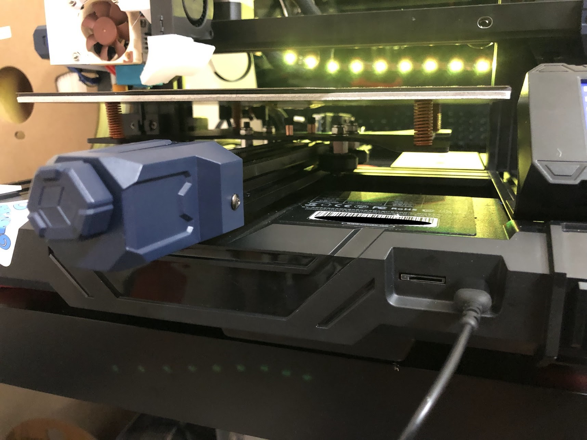
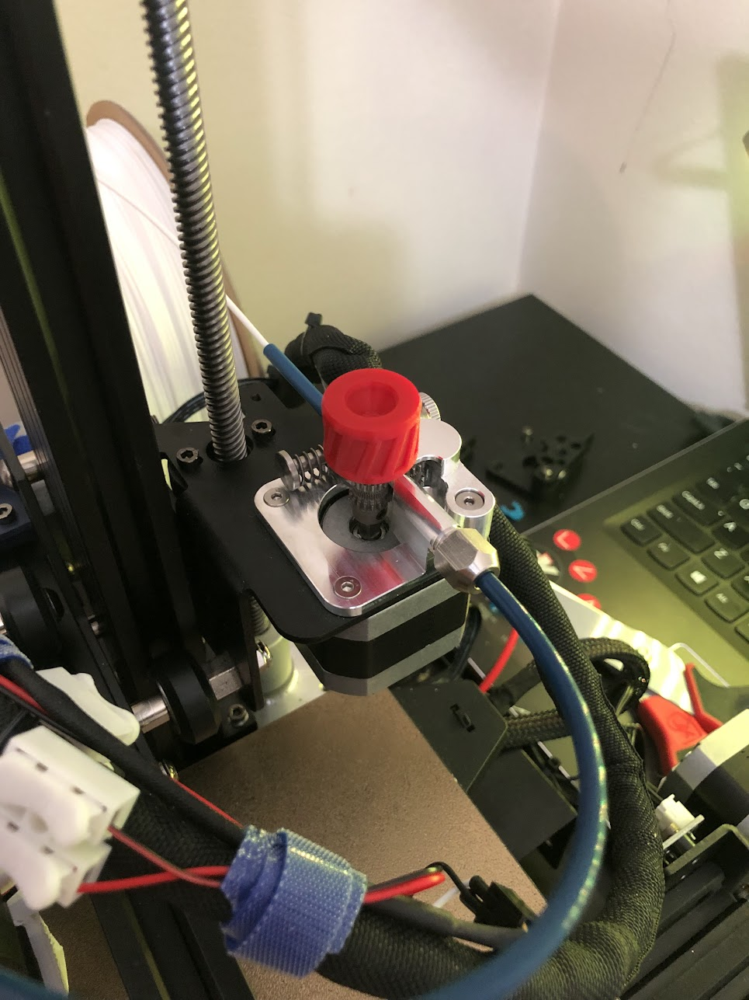

## Modifications Using Purchased Parts
#### Spring Bolts  \- 9/10

I purchased the [capricorn bowden kit](https://www.microcenter.com/product/659621/Capricorn_Bowden_Tube_Kit_for_Ender_3-3_Pro-3_V2-Ender_5_Series-CR_10_Series){target=_blank} from MicroCenter to install the bowden tube and get the cutters to make sure I got flush cuts. I also saw that it came with springs which I thought might fit around the bed bolts. Turns out they do! By swapping out the plastic pillars for these springs, the bed can be adjusted to be more consistent and flush vs the stock plastic pillars. My method for leveling with this setup is to print four leveling squares, check their consistency, then adjust whatever corner looks the worst. To see results faster, I use the mesh visualization feature in Octoprint since it also lets me see numbers. I feel like a normal ender 3 kit may fit this printer, but I'm not certain. That will have to be an experiment for another time.Capricorn

&#x200B;

#### [Capricorn Bowden Tube](https://www.microcenter.com/product/625642/creality-capricorn-1-meter-bowden-ptfe-tube-(without-pneumatic-connector)){target=_blank} \- 6/10

This is standard for the ender 3 community, and plays fine with the Go. I will say the OEM extruder had issue pushing filament through when first installed. Eventually it worked but I had to make the spring arm extremely loose for the teeth to grip. I will say the benefit is that the kit I got included the  bed springs, as well as a lot of this bowden tube, for $13. I feel like thats a good enough deal for the springs and the bowden tubing that doesnt burn. Other than that I dont feel like it improved print quality.

&#x200B;

#### [MicroSwiss Hotend](https://store.micro-swiss.com/collections/all-metal-hotend-kits){target=_blank} \- 9/10

Expensive? Yes. Worth? Yes. This hotend has been awesome in terms of print quality and speed. It does have drawbacks though. The OEM heating capsule fits but the thermistor does not. I bought the bog standard [creality thermistor](https://www.microcenter.com/product/625641/Ender-3_Pro_Hotend_Thermistor){target=_blank} which was short, so I cut some length off the old thermistor and added the length I needed. Heat up times (after a PID tune) feel much faster and as a plus the bowden tubing doesnt come into direct contact with the hotend. This means that even if you keep the OEM bowden tubing, the tip of the tube wont become burnt over time. My OEM tubing was burnt/burning after owning the machine for a month and only printing PLA/+ with the stock hot end.

&#x200B;

#### [MicroSwiss Extruder](https://store.micro-swiss.com/products/micro-swiss-bowden-dual-gear-extruder){target=_blank} \- 8/10

Another expensive but worthwhile upgrade. This has helped an immense amount vs the OEM extruder.  With OEM tubing, the OEM extruder is acceptable, I never had issues with it. Retraction with the microswiss (MS) extruder is much better. My distances are much shorter with lower speed vs stock (3.5mm MS vs 7.5mm stock). After moving to Capricorn, the OEM extruder couldn't get a consistent grip. The MS is dual geared so its got a lot more grip and I've had no issues since. The only caveat is that you'll have to swap pins on the plug to get it to work correctly. I watched [this video](https://www.youtube.com/watch?v=AgyNM7FQrmk){target=_blank} to do it, takes about 10 seconds.

&#x200B;

#### [5015 Fan](https://www.amazon.com/dp/B079BPS9Q8?ref=ppx_yo2ov_dt_b_product_details&th=1){target=_blank} \- 7/10

Pretty worth. Unfortunately with the motherboard running stock marlin the fan is either 100% on or off. This can be an issue when printing long bridges or other structures as the fan could actually blow them askew. The PWM is not very forgiving when it comes to this model. I was working to resolve this with some firmware modification but have since gone a completely different route and bought a new motherboard, so we'll see how that goes (follow up will be posted).

&#x200B;

#### [5015 Shroud](https://www.printables.com/model/348478-monomonster){target=_blank} \- 9/10

Bit of a self plug, but I created this print head/shroud to house a single 5015 to give that maximum cooling potential. As I mentioned above, the fan can blow structures away but often times it doesnt. Definitely helps bridging and overhangs, I have examples of those results within the description of the part.

&#x200B;

#### [Noctua 40mm Fan](https://noctua.at/en/nf-a4x20-flx){target=_blank}\- 10/10

Extremely worth it. The little amount of noise that this fan produces is incredible. It doesnt move as much air as the stock fan, but its still effective. The noise tradeoff vs. effectiveness is easily decided for me, noise won. A caveat is the need for a buck converter to use this fan correctly, as it requires 12v while the Go sends 24v.

&#x200B;

#### [Buck converters](https://www.amazon.com/dp/B07VVXF7YX?psc=1&ref=ppx_yo2ov_dt_b_product_details){target=_blank} \- 10/10

These things are so useful, they can take 24v input and dial it to whatever output voltage you need. I currently have these running the noctua and arctic fan. These are also useful for any other applicable projects, so thats nice.

&#x200B;

#### [Dual Z-Axis](https://biqu.equipment/products/biqu-b1-double-z-axis-upgrade-kit){target=_blank} - 8/10

I have yet to print a benchy using this dual setup, so I dont know the real-world improvements. Generally though support on each end of the gantry is always beneficial so this should help in some way. I purchased the [BIQU Dual-Z Kit](https://www.microcenter.com/product/639846/Dual_Z-Axis_Upgrade_Kit,_T8-8mm_415mm_Lead_Screw_Dual_Z_Step_Motor_42mm_Upgrade_Kit_for_BIQU_B1_3D_Printer){target=_blank} which fit perfectly with the existing gantry bracket. I used the motor mount seen in [this post](https://www.reddit.com/r/anycubic/comments/1083sr2/kobra_neogo_dual_z_mod/){target=_blank} from /u/DrumsticknDrumstick to mount the motor to the z-post. Keep in mind if you're using the stock motherboard you'll need a splitter for the stepper motor, such as [this one from TH3D](https://www.th3dstudio.com/product/dual-z-stepper-motor-adapter-w-cable/){target=_blank}.

## Firmware/Software Alternatives
Using third party software control is a fantastic way to make your printing experience both easier and more versatile. The crux of these upgrades is that in order to run them one will need to acquire a computer to do so. Normally a RaspBerry Pi is used (>gen3), however, we are now on our 3rd year of the great pi shortage meaning either getting creative or looking elsewhere. I was using a Lenovo Ideapad for a while, it had 8GB of ram, 4 cores and didnt break a sweat running Octoprint or Klipper. This is to say that while a Pi would be preferred and is assumed by many guides, any computer can work. 

#### [Octoprint](https://octoprint.org/){target=_blank} - 8/10

Acting as a remote control host, Octoprint controls your printer via a web interface while keeping all other software stock. This means little to no improvement in raw performance but big improvements in ease of use. 

#### [Kobra Go Klipper!](https://reddit.com/r/anycubic/comments/10cwm16/install_klipper_on_kobra_go_or_neo/){target=_blank} \- 11/10

Thanks to /u/xpeng121 we now have Klipper on the Go! Klipper is similar to marlin, but offloads a lot of the complex calculations to a head unit (pc/raspi) which allows for faster print speeds and artifact-reduction. Keep in mind that Klipper doesnt use a screen, it is web-interface only. Personally I enjoy that, but ymmv! This is definitely something to look into and a fantastic way to make the Go more performant.

## Stock Modifications

