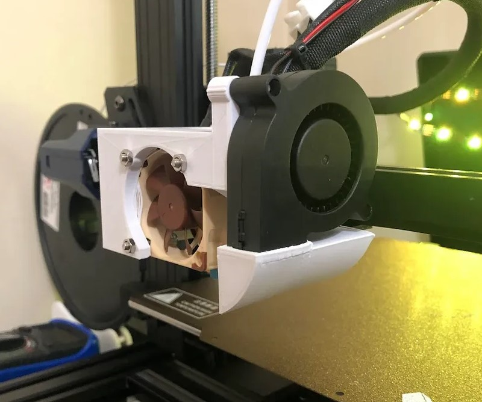

# [5015 Shroud](https://www.printables.com/model/348478-monomonster){target=_blank} \- 9/10

Bit of a self plug, but I created this print head/shroud to house a single 5015 to give that maximum cooling potential. As I mentioned above, the fan can blow structures away but often times it doesnt. Definitely helps bridging and overhangs, I have examples of those results within the description of the part.

