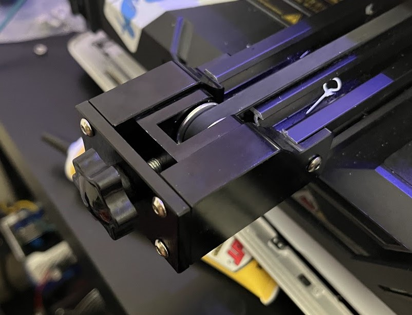

## [Steel Y-Axis Pulley](https://amzn.to/4ayguIc)

After some time I noticed that my y-axis began to squeak and have some irregular movement. When I took the stock end apart I saw that while there was a metal axle and bearing, the rest of the assembly was plastic! While not bad in theory, for my use case and faster speeds this simply would not do. Not only that, but over time the metal axle will eat into its plastic housing and cause the printer to become unaligned. I then looked into finding an all-metal y-axis and found [this one!](https://amzn.to/4ayguIc) The y-axis fits stock, even using the stock bolt holes in the frame! 

## Steel X-Axis Pulley
The pulley that comes in that kit is semi-compatible with the printer, but it will have to be at maximum extension and secured with only one bolt. If one wished they could drill and tap a new hole into the x-axis. I've found that the single bolt is sufficient.