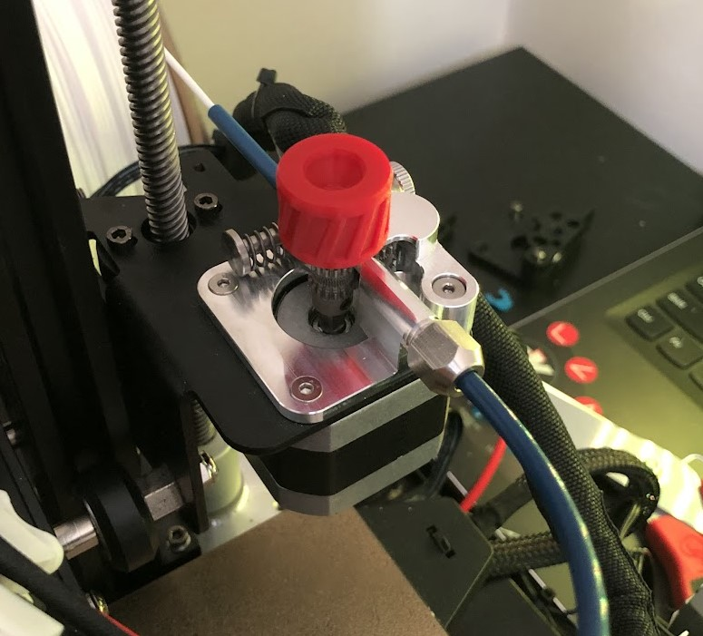

# [MicroSwiss Extruder](https://store.micro-swiss.com/products/micro-swiss-bowden-dual-gear-extruder){target=_blank} \- 8/10
Another expensive but worthwhile upgrade. This has helped an immense amount vs the OEM extruder.  With OEM tubing, the OEM extruder is acceptable, I never had issues with it. Retraction with the microswiss (MS) extruder is much better. My distances are much shorter with lower speed vs stock (3.5mm MS vs 7.5mm stock). After moving to Capricorn, the OEM extruder couldn't get a consistent grip. The MS is dual geared so its got a lot more grip and I've had no issues since. The only caveat is that you'll have to swap pins on the plug to get it to work correctly. I watched [this video](https://www.youtube.com/watch?v=AgyNM7FQrmk){target=_blank} to do it, takes about 10 seconds.

