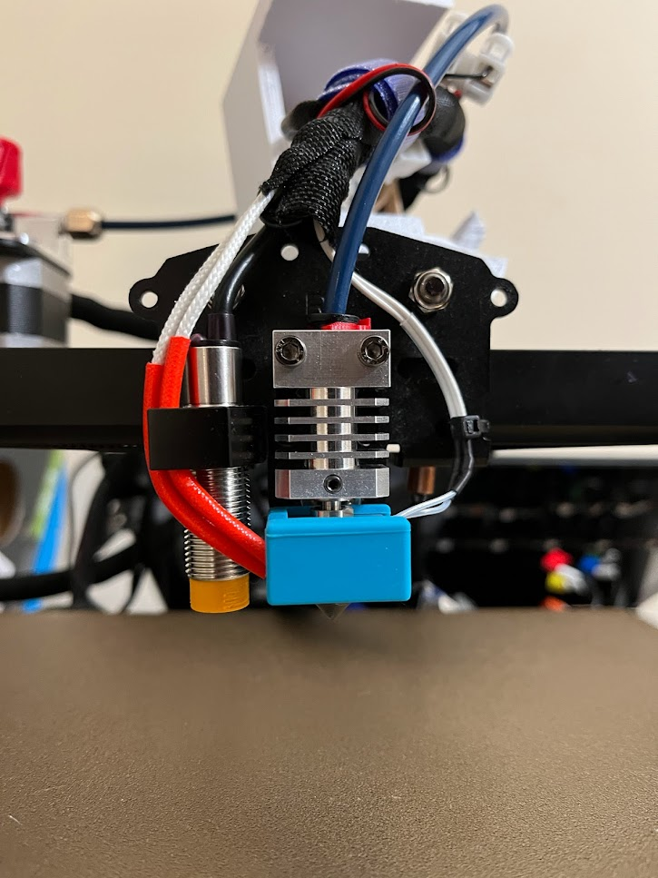

# [MicroSwiss Hotend](https://store.micro-swiss.com/collections/all-metal-hotend-kits){target=_blank} \- 9/10

Expensive? Yes. Worth? Yes. This hotend has been awesome in terms of print quality and speed. It does have drawbacks though. The OEM heating capsule fits but the thermistor does not. I bought the bog standard [creality thermistor](https://www.microcenter.com/product/625641/Ender-3_Pro_Hotend_Thermistor){target=_blank} which was short, so I cut some length off the old thermistor and added the length I needed. Heat up times (after a PID tune) feel much faster and as a plus the bowden tubing doesnt come into direct contact with the hotend. This means that even if you keep the OEM bowden tubing, the tip of the tube wont become burnt over time. My OEM tubing was burnt/burning after owning the machine for a month and only printing PLA/+ with the stock hot end.

