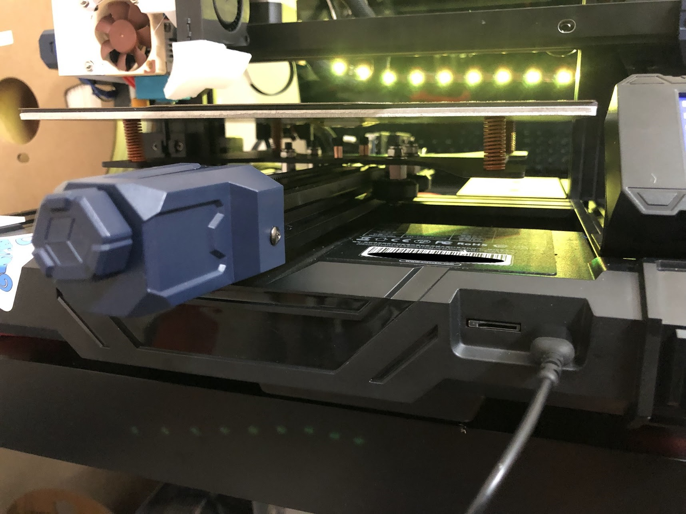

# Spring Bolts
I purchased the [capricorn bowden kit](https://www.microcenter.com/product/659621/Capricorn_Bowden_Tube_Kit_for_Ender_3-3_Pro-3_V2-Ender_5_Series-CR_10_Series){target=_blank} from MicroCenter to install the bowden tube and get the cutters to make sure I got flush cuts. I also saw that it came with springs which I thought might fit around the bed bolts. Turns out they do! By swapping out the plastic pillars for these springs, the bed can be adjusted to be more consistent and flush vs the stock plastic pillars. My method for leveling with this setup is to print four leveling squares, check their consistency, then adjust whatever corner looks the worst. To see results faster, I use the mesh visualization feature in Octoprint since it also lets me see numbers. I feel like a normal ender 3 kit may fit this printer, but I'm not certain. That will have to be an experiment for another time.

